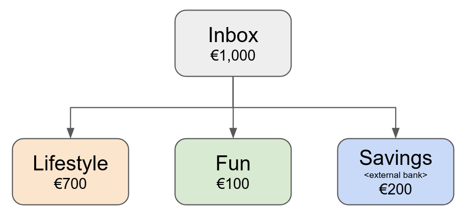
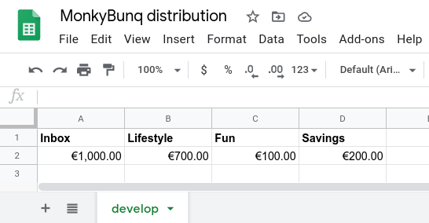

Documentation

# MonkyBunq
MonkyBunq offers a cli tool to distribute money, configured in a Google Sheet, from a Bunq account to sub-accounts or external bank accounts.

Motivation is, to automate money splitting for different purposes - especially useful, if the amount to split changes from month to month.

## Let's do an example

### Create an account model.

- Consider you have a Bunq account, where your salary (€1,000) is deposited, we name it `Inbox`.
- Our `Lifestyle` account is used to pay our rent and food.
- Our `Fun` account is used to pay for travels or restaurant visits.
- The remaining amount is going to the `Savings` account, which resides on another bank.

**Result:** The `Inbox` €1,000 will be distributed to the other accounts.
- €700 to `Lifestyle`
- €100 to `Fun`
- €200 to `Savings`

**Note down the IBAN for each account** - we need it later.

### Configure your Google Sheet for the distribution.

- The sheet shows the amount for the transaction split for each account.

**Note down the Google Sheet ID (see URL)** - we need it later.
**Note down the worksheet name (`develop` is the name in the example above)** - we need it later.
**Note down the amount cells (A2, B2, etc.)** - we need it later.

## Setup

### Google sheet
1. Create a Google system account, share it with your sheet and download the JSON access configuration file.
	- Place it in the `config` directory.
2. Rename `config/config.json.dist` to `config/config.json`.
3. Edit `config/config.json`:
	- Enter the Google access config file to `Gsheet.auth.configFile`.

### Account configuration
1. Rename `config/monetary-distribution-config.json.dist` to `config/monetary-distribution-config.json`.
2. Edit `config/monetary-distribution-config.json`:
	- Enter the `sheetId` and `worksheet` name.
	- Enter your source IBAN (`Inbox` account) and `value.worksheetCell` (A2 in the example above)
	- Enter the target account IBANs, recipient names and amount cells (B2, C2, D2 in the example above)

### Distribution execution

0. Build the docker image and create docker volume `monkybunq` volume. Transfer all files in `config/*` to the volume.
1. Start a dry-run to validate everything.
  `docker run --rm -ti -v monkybunq-config:/config monkybunq distribute --dry`
  Check the result is expected.
2. If it is successful, start the production execution.
`docker run --rm -ti -v monkybunq-config:/config monkybunq distribute`
3. Last step is to acknowledge the transaction in the Bunq app.

Voila ;-)
